

<h3><code>mlandukid@github ~ $ ./contributions.sh</code></h3>
<picture>
  <source media="(prefers-color-scheme: dark)" srcset="./contrib-heatmap.svg" />
  <source media="(prefers-color-scheme: light)" srcset="./contrib-heatmap-light.svg" />
  
</picture>

  

<h3><code>mlandukid@github ~ $ whoami</code></h3>
<table>
  <tr>
    <td valign="top">
      <picture>
        <source media="(prefers-color-scheme: dark)" srcset="./ascii-portrait.svg" />
        <source media="(prefers-color-scheme: light)" srcset="./ascii-portrait-light.svg" />
        
      </picture>
    </td>
    <td valign="top">
      <picture>
        <source media="(prefers-color-scheme: dark)" srcset="./info-card.svg" />
        <source media="(prefers-color-scheme: light)" srcset="./info-card-light.svg" />
        
      </picture>
    </td>
  </tr>
</table>

  

<h3><code>mlandukid@github ~ $ ./snake.sh</code></h3>
<picture>
  <source media="(prefers-color-scheme: dark)" srcset="./dist/github-contribution-grid-snake-dark.svg" />
  <source media="(prefers-color-scheme: light)" srcset="./dist/github-contribution-grid-snake.svg" />
  
</picture>

